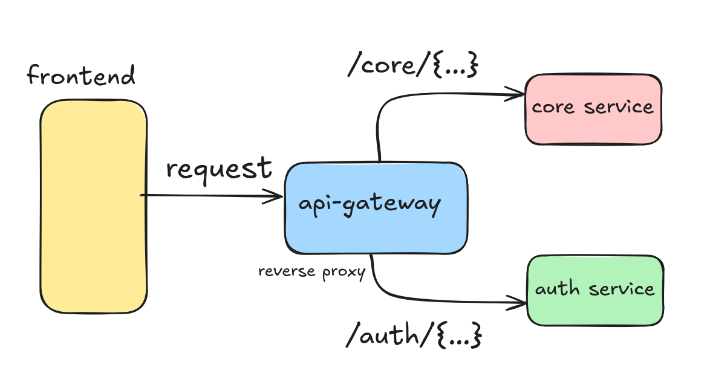

# chirp-api-gateway

-----

API gateway between auth and core services and frontend

Built with Go - Gin

-----

This API gateway serves as a single point of entry for all client requests.

Forwards incoming requests to appropriate backend service based on prefix

`/auth/{...}` -> Forwarded to chirp-auth-service

`/core/{...}` -> Forwarded to chirp-core-service

Prefixes are trimmed before forwarding to ensure compatibility with backend service API specifications

-----

This functions as a reverse proxy layer, handling all incoming requests and directing them to correct backend microservice. Abstracts the complicated nature of multiple backend endpoints by providing a unified entry point.

-----
